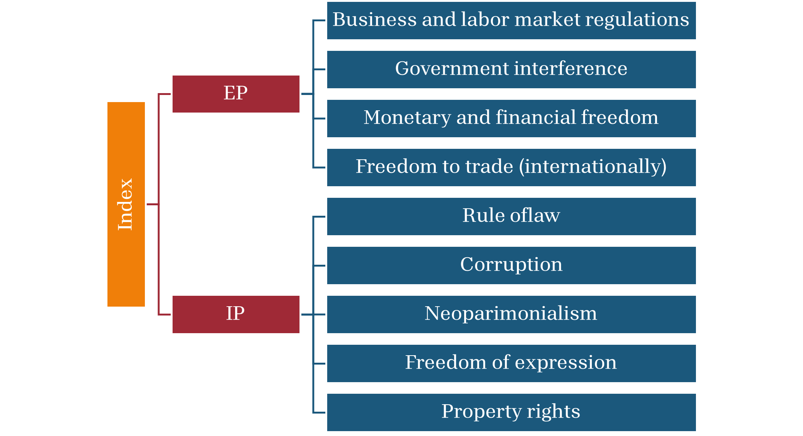

## Conceptualization

The Latin American Left-Leaning Populism Index (LALLPI) measures populism by combining rhetorical populism with active policies. This approach allows the index to differentiate between (a) leaders who engage in populist rhetoric without implementing corresponding actions, and (b) typically populist policies enacted by non-populist leaders. For example, two governments may have leaders with similar populist rhetoric, but only one may be actively pursuing policy changes. The index is calculated using a combination of rhetoric and policy scores, which range from less to more populist. On its most basic form, the index (POP) equals rhetoric×policy, where rhetoric ∈[0,1] and policy ∈[0,100] go from less to more populism.

Active populism comprises two sub-indices: Economic Populism (EP) and Institutional Populism. This categorization aims to capture the multi-dimensional nature of populist regimes. EP focuses on the typical economic policies implemented by a populist regime, while IP examines actions against the rule of law and democratic liberal institutions. These sub-indices represent the intersection of populist policies (economic or institutional) with populist motives.

For instance, income distribution is a common left-leaning populist policy that can also be carried out by non-populist regimes. A high populist index indicates that the implementation of populist policies, such as income distribution, is driven by populist reasons. Unlike other indices, this construct examines whether populist rhetoric translates into action and whether the action results from populist motives. In summary, while most populist indices measure the extent of populist rhetoric, this index expands its scope to include active populism as measured by institutional and economic policies. The index allows for a dual interpretation: the extent to which populist policies are enacted for populist reasons and how much populist rhetoric translates into policy action.

$POP=POP_R⋅(EP+IP)=(POP_R⋅EP)+(POP_R⋅IP)=(PEP+PIP)$

By aligning populist policies with populist rhetoric, the index can differentiate between non-populist regimes implementing populist policies and populist regimes not doing so. This detailed information allows for the analysis of various scenarios, including (Table 1):
Table 1. Latin American Left-Leaning Populist Index scenarios

| Scenario                                         | Index value                        |
| ------------------------------------------------ | ---------------------------------- |
| Overall effect of active populism                | *POP*                              |
| Economic populism                                | High *EP* and low *POP*            |
| Institutional populism                           | High *IP* and low *POP*            |
| Non-active populism                              | High *POP_R* and low *EP* and *IP* |
| Populist economic populicies by non-populists    | Low *POP_R* and high *IP*          |
| Populist institutional policies by non-populists | Low *POP_R* and high *EP*          |
 ***Table 1**. Latin American Left-Leaning Populist Index scenarios*

## Estimation

The rhetoric measure (*POP_R*) is V-Party’s Populism Index, which ranges from 0 (less populism) to 1 (more populism). This measure calculates the harmonic mean of “anti-elitism” and “people-centrism.” The index assesses the degree to which representatives of the party use populist rhetoric (narrowly defined). Using V-Party’s populism index allows for coverage of a wide range of countries and years.

The V-Party measures populism at the political party level. Each year, *POP_R* reflects the V-Party value for the President's party. If a new president takes office, *POP_R* uses the value of the President who served longer that year. Years without data are interpolated when possible. 

**Economic Populism** is the simple average of four policy variables. Additionally, each $EP_i$ has more than one source (Table 2).

| Definition                            | Term   | Inputs                                         |
| ------------------------------------- | ------ | ---------------------------------------------- |
| **Economic populism**                 | $EP$   | $EP = \frac{EP_1 + EP_2 + EP_3 + EP_4}{4}$     |
| Business and labor market regulatoins | $EP_1$ | $EP_1 = \frac{EP_{11} + EP_{12} + EP_{13}}{3}$ |
| Government interference               | $EP_2$ | $EP_2 = \frac{EP_{21} + EP_{22}}{2}$           |
| Monetary and financial freedom        | $EP_3$ | $EP_3 = \frac{EP_{31} + EP_{32} + EP_{33}}{3}$ |
| Freedom to trade                      | $EP_4$ | $EP_4 = \frac{EP_{41} + EP_{42}}{2}$           |
***Table 2**.Economic Populism components and structure*

Table 3 provides the source, variable name, and variable code for each input to *EP* (where IEF stands for Heritage Foundation's *Index of Economic Freedom* and EFW stands for Fraser Institute's *Economic Freedom of the World*)

| Sub-index    | Source | Variable                           | Variable code       |
| ------------ | ------ | ---------------------------------- | ------------------: |
| $EP_{11}$    | IEF    | Business freedom                   | `Business freedom`  | 
| $EP_{12}$    | EFW    | Labor market regulations           | `5A`                |
| $EP_{13}$    | EFW    | Business regulations               | `5C`                |
| $EP_{21}$    | EFW    | Transfers and subsidies            | `1B`                |
| $EP_{22}$    | EFW    | State ownership                    | `1E`                |
| $EP_{31}$    | IEF    | Monetary freedom                   | `Monetary freedom`  |
| $EP_{32}$    | IEF    | Financial freedom                  | `Financial freedom` |
| $EP_{33}$    | EFW    | Foreign currency and bank accounts | `3D`                |
| $EP_{41}$    | IEF    | Trade freedom                      | `Trade freedom`     |
| $EP_{42}$    | EFW    | Freedom to trade internationally   | `4`                 |
***Table 3**. Economic populism sources*

Institutional Populism looks at five (5) institutional variables typically ob-served in populist regimes. *IP* is the simple average of these five variables. When available, the index uses more than one source.

| Definition                 | Term   | Inputs                                                    |
| -------------------------- | ------ | --------------------------------------------------------- |
| **Institutional populism** | $IP$   | $IP = \frac{IP_1 + IP_2 + IP_3 + IP_4 + IP_5}{5}$         |
| Rule of law                | $IP_1$ | $IP_1 = \frac{IP_{11} + IP_{12} + IP_{13}}{3}$            |
| Corruption                 | $IP_2$ | $IP_2 = \frac{IP_{21} + IP_{22}}{2}$                      |
| Neopatrimonialism          | $IP_3$ | $IP_3 = IP_{31}$                                          |
| Freedom of expression      | $IP_4$ | $IP_4 = IP_{41}$                                          |
| Property rights            | $IP_5$ | $IP_5 = IP_{51}$                                          |
***Table 4**. Institutional Populism components and structure*

Sources, variables names, and variable codes for IP are included in Table 4.

| Sub-index | Source | Variable                                 | Variable code          |
| --------- | -------|----------------------------------------- | ---------------------- |
| $IP_{11}$ | V-Dem  | Rule of law                              | `v2x_rule`             |
| $IP_{12}$ | V-Dem  | Judiciary constraints on the executive   | `v2x_jucon`            |
| $IP_{13}$ | V-Dem  | Legislative constraints on the executive | `v2xlg_legcon`         |
| $IP_{21}$ | V-Dem  | Corruption                               | `2x_execorr`           |
| $IP_{22}$ | IEF    | Government Integrity                     | `Government integrity` |
| $IP_{31}$ | V-Dem  | Neopatrimonialism                        | `2x_neopat`            |
| $IP_{41}$ | V-Dem  | Freedom of expression                    | `v2mecenefm_osp`       |
| $IP_{51}$ | IEF    | Property rights                          | `Property rights`      |
***Table 5**. Institutional populism sources* 

## Results and selected data

Index results are consistent with countries that the literature already identifies as populist regimes (Celico et al., 2024; Funke et al., 2023). Table 6 presents index values and rankings for all countries with data in 2018. The ranking aligns with existing literature. For example, Venezuela, Bolivia, Nicaragua, and Ecuador ranked high in 2018. This year, Argentina ranks lower as Macri’s Cambiemos centrist political coali-tion was governing at the time. El Salvador provides an interesting case where Nayib Bukele is better categorized as a right-leaning rather than left-leaning populist. Ac-cordingly, his *EP* score is low, while his IP is higher. This is consistent with left- and right-leaning populist regimes following different economic policies but being analo-gous on the institutional front. 

|                    | POP      |           | PEP      |           | PIP      |           | POP_R     |           |
| ------------------ | -------- | --------- | -------- | --------- | -------- | --------- | --------- | --------- |
| **Country**        | **Rank** | **Value** | **Rank** | **Value** | **Rank** | **Value** | **Rank**  | **Value** |
| Venezuela          | 1        | 79.8      | 1        | 68.6      | 1        | 91.1      | 1         | 0.99      |
| Bolivia            | 2        | 45.5      | 3        | 31.6      | 3        | 59.3      | 3         | 0.87      |
| Nicaragua          | 3        | 40.3      | 4        | 19.6      | 2        | 61.1      | 5         | 0.69      |
| Ecuador            | 4        | 38.4      | 2        | 34.2      | 4        | 42.7      | 2         | 0.69      |
| El Savlador        | 5        | 27.5      | 5        | 17.1      | 5        | 37.9      | 4         | 0.72      |
| Colombia           | 6        | 14.5      | 8        | 14.1      | 6        | 14.8      | 8         | 0.47      |
| Costa Rica         | 7        | 12.9      | 7        | 14.5      | 8        | 11.2      | 6         | 0.61      |
| Barbados           | 8        | 11.5      | 9        | 14.1      | 12       | 9.0       | 10        | 0.37      |
| Uruguay            | 9        | 10.5      | 6        | 14.8      | 18       | 6.2       | 7         | 0.48      |
| Panama             | 10       | 10.4      | 13       | 7.4       | 7        | 13.4      | 11        | 0.33      |
| Trinidad y Tobago  | 11       | 9.8       | 10       | 11.0      | 11       | 8.6       | 9         | 0.39      |
| Brazil             | 12       | 8.1       | 11       | 7.6       | 13       | 8.7       | 13        | 0.22      |
| Jamaica            | 13       | 7.2       | 12       | 7.4       | 16       | 7.0       | 12        | 0.30      |
| Guatemala          | 14       | 7.2       | 15       | 4.3       | 9        | 10.0      | 14        | 0.18      |
| Dominican Republic | 15       | 6.5       | 18       | 3.6       | 10       | 9.5       | 19        | 0.13      |
| Paraguay           | 16       | 6.2       | 17       | 3.9       | 15       | 8.5       | 17        | 0.15      |
| Argentina          | 17       | 6.2       | 14       | 6.3       | 19       | 6.1       | 15        | 0.17      |
| Mexico             | 18       | 5.5       | 16       | 4.0       | 17       | 6.9       | 18        | 0.14      |
| Honduras           | 19       | 2.6       | 20       | 1.4       | 20       | 3.7       | 20        | 0.06      |
| Chile              | 20       | 2.4       | 19       | 3.0       | 21       | 1.8       | 16        | 0.15      |
***Table 6**. Index values and ranking, 2018*

Table 6 illustrates an additional characteristic of the index. Given that populist policies are measured on a scale from 0 (indicating less populism) to 100 (indicating more populism) and adjusted by POP_R, which ranges between 0 and 1, the index values for PEP and PIP are expected to be relatively low. This is evident in the signifi-cant gap between the index values for Venezuela and Bolivia, the latter being the next country in the ranking. In section 5, we will provide a more detailed analysis of the five countries with the highest populist values between approximately 2000 and 2018.

The index indicates that populist regimes score higher on the Institutional Populism (*PIP*) sub-index compared to the Economic Populism (*PEP*) sub-index (Figure 2). This disparity may be attributable to the variables contributing to each sub-index. 

<noscript></noscript>

---

Looking at a time series for the region, the data shows an upward trend in the early 2000s, peaking between 2009 and 2014.

<noscript></noscript>

---

<noscript></noscript>

---

<noscript></noscript>

---

<noscript></noscript>
